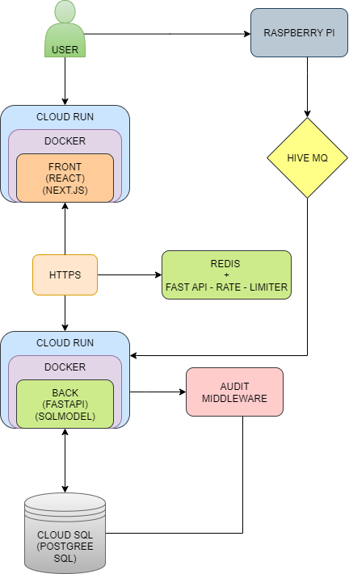

# Arquitetura do Sistema de **Transporte Fretado**

Este documento descreve a arquitetura completa do **Sistema Interno de Transporte Fretado**, contemplando backend, frontend, banco de dados, cache, middlewares de segurança e deploy em nuvem **serverless (GCP Cloud Run)**.

---

## 1. Visão Geral

O sistema permite o gerenciamento completo do **transporte fretado interno**, incluindo **autenticação de colaboradores via Azure AD**, gerenciamento de linhas de ônibus, horários, ocupação de veículos, **relatórios detalhados de viagens** e **auditoria completa de acessos**. O sistema suporta login via **Azure AD**, com interface web responsiva integrada ao ecossistema.

**Sistema IoT Integrado:** Cada ônibus possui um **Raspberry Pi** embarcado com leitor RFID para autenticação do motorista via crachá, comunicação MQTT via **HiveMQ** para atualizações em tempo real de ocupação e geração automática de relatórios de viagem.

- **Frontend:** **Next.js** + **React** + **Tailwind CSS**, container Docker, deploy no **Cloud Run**.
- **Backend:** **FastAPI** + **SQLModel** + **Redis** + **Python**, container Docker, deploy no **Cloud Run**.
- **Banco de dados:** **Cloud SQL (PostgreSQL)** para persistência.
- **Cache / Rate Limiter:** **Redis** para rate limiting.
- **IoT / MQTT:** **HiveMQ** para comunicação com dispositivos Raspberry Pi nos ônibus.
- **Tempo Real:** **WebSocket** para atualizações em tempo real da página.
- **Segurança:** **CSP**, **CORS**, **HTTPS** redirect, headers de segurança, **GZip** e **TrustedHosts**.
- **Audit Logging:** registra IP, método, path, user-agent, status code, timestamp.

---

## 2. Backend

### 2.1 Stack e Bibliotecas

- `fastapi` → framework para APIs.
- `sqlmodel` → ORM para persistência.
- `cryptography` → **Fernet** para criptografia de senhas.
- `passlib[bcrypt]` → hashing de senhas.
- `pyjwt` → **JWT** tokens.
- `python-jose` → **JWT** tokens e validação de tokens **Azure AD**.
- `redis` + `fastapi-limiter` → rate limiting.
- `paho-mqtt` → cliente MQTT para comunicação com dispositivos IoT (Raspberry Pi).
- `websockets` → suporte a WebSocket para atualizações em tempo real.
- `uvicorn` → servidor **ASGI**.
- `asyncpg` → conexão assíncrona com **PostgreSQL**.
- `cloud-sql-python-connector[asyncpg]` → conector **Cloud SQL** para **PostgreSQL**.
- `python-dotenv` → variáveis de ambiente.
- `python-multipart` → processar requisições form-data.

### 2.2 Estrutura de Rotas

| Rota                  | Método | Função                                    |
|-----------------------|--------|------------------------------------------|
| `/login`              | POST   | Autenticação de usuário                  |
| `/bus/`               | GET    | Listar ônibus                            |
| `/bus/{prefix}`       | GET    | Obter ônibus por prefixo                 |
| `/bus/{prefix}`       | PATCH  | Atualizar ônibus                         |
| `/bus/{prefix}/occupancy` | GET | Obter ocupação do ônibus                 |
| `/bus/{prefix}/occupancy` | PATCH | Atualizar ocupação                       |
| `/bus/{prefix}/assign-line/{line_id}` | PATCH | Atribuir ônibus a linha                  |
| `/line/`              | GET    | Listar linhas                            |
| `/line/{id}`          | GET    | Obter linha por ID                       |
| `/line/{id}`          | PATCH  | Atualizar linha                          |
| `/line/{id}/status`   | PATCH  | Atualizar status da linha                |
| `/city/`              | GET    | Listar cidades                           |
| `/city/{id}`          | GET    | Obter cidade por ID                      |
| `/schedule/`          | GET    | Listar horários                          |
| `/schedule/{id}`      | GET    | Obter horário por ID                     |
| `/schedule/`          | POST   | Criar horário                            |
| `/schedule/{id}`      | PATCH  | Atualizar horário                        |
| `/schedule/{id}`      | DELETE | Deletar horário                          |
| `/user/`              | GET    | Listar usuários                          |
| `/user/{totvs_id}`    | GET    | Obter usuário por TOTVS ID               |
| `/trip-report/`       | GET    | Listar relatórios de viagem              |
| `/trip-report/{id}`   | GET    | Obter relatório de viagem por ID         |
| `/trip-report/`       | POST   | Criar relatório de viagem                |
| `/trip-report/{id}`   | PATCH  | Atualizar relatório de viagem            |
| `/ws/fretado`         | WS     | WebSocket para atualizações em tempo real |
| `/mqtt/bus/{prefix}/driver-auth` | POST | Receber autenticação RFID do motorista   |
| `/mqtt/bus/{prefix}/occupancy` | POST | Atualizar ocupação via MQTT             |
| `/mqtt/bus/{prefix}/status` | POST | Status do ônibus (online/offline)       |
| `/driver/{totvs_id}/available-buses` | GET | Ônibus disponíveis para o motorista     |

### 2.3 Fluxo de uma requisição

1. **Autenticação Inicial**: Usuário faz login via `/login` com credenciais tradicionais ou recebe **JWT** da **Azure AD**.
2. **Validação**: Backend valida credenciais ou processa/verifica **JWT** da **Azure** diretamente no código.
3. **Token JWT**: Token **JWT** (gerado internamente ou da **Azure**) é usado para autenticar requisições subsequentes.
4. **Sistema IoT**: Motorista passa crachá RFID no **Raspberry Pi** do ônibus, que publica via MQTT no tópico `/bus/{prefix}/driver-auth`.
5. **Atribuição de Rota**: Backend recebe mensagem MQTT, valida motorista e libera rotas disponíveis no app do motorista.
6. **Seleção de Rota**: Motorista seleciona rota desejada, ônibus é automaticamente atribuído à linha via `/bus/{prefix}/assign-line/{line_id}`.
7. **Atualização em Tempo Real**: Ocupação do ônibus é atualizada via MQTT e refletida no frontend via WebSocket.
8. **Auditoria**: Sistema registra **auditoria** de cada requisição (IP, método, path, etc.).
9. **Relatórios**: **Relatórios de viagem** são gerados automaticamente quando ônibus são desatribuídos de linhas.
10. **Persistência**: Dados são consultados/alterados no banco PostgreSQL.

### 2.4 Middlewares

- **AuditMiddleware** → registra logs no banco.
- **SecurityHeadersMiddleware** → CSP, HSTS, X-Frame-Options, X-XSS-Protection, Cache-Control etc.
- **CORS** → permite apenas frontend autorizado.
- **TrustedHostMiddleware**, **HTTPSRedirectMiddleware**, **GZipMiddleware**.
- **RateLimiter** → **Redis** + `fastapi-limiter`.

---

## 3. Frontend

### 3.1 Stack

- `React` + `Next.js` → SPA com server-side rendering.
- Container Docker no Cloud Run.

### 3.2 Componentes Principais

#### 3.2.1 Login

- Autenticação tradicional (usuário/senha) ou via Azure AD.
- Recebimento e validação de **JWT** tokens da **Azure** diretamente no código.
- Redirecionamento para home após login.

#### 3.2.2 HomePage

- Saudação personalizada.
- Links para funcionalidades: bater ponto, fretado, perfil.
- Exibição de saldo de horas trabalhadas.

#### 3.2.3 FretadoPage

- Listagem de cidades e linhas disponíveis.
- Exibição de horários de partida/chegada.
- Informações de ocupação dos ônibus.
- WebSocket: Atualizações em tempo real da página sem necessidade de refresh.
- Sistema de **cache local** e **backup offline** para funcionamento sem conexão.
- Expansão/colapso de informações detalhadas.

---

## 3.3 Sistema IoT - Raspberry Pi

### 3.3.1 Hardware por Ônibus

Cada ônibus possui um **Raspberry Pi 4** embarcado com os seguintes componentes:

- **Raspberry Pi 4 Model B** (4GB RAM)
- **Leitor RFID RC522** para autenticação de crachás
- **Fonte de alimentação 12V→5V** integrada ao sistema elétrico do ônibus
- **Antena WiFi/4G** para conectividade

### 3.3.2 Software do Raspberry Pi

- **Sistema Operacional**: Raspberry Pi OS Lite (64-bit)
- **Linguagem**: Python 3.9+
- **Bibliotecas**:
  - `paho-mqtt` → Cliente MQTT para comunicação com backend
  - `mfrc522` → Driver para leitor RFID RC522
  - `RPi.GPIO` → Controle de GPIOs

### 3.3.3 Funcionalidades do Sistema IoT

#### Autenticação RFID
1. Motorista aproxima **crachá** do leitor RFID
2. Raspberry Pi lê UID do crachá
3. Publica mensagem MQTT no tópico `/bus/{prefix}/driver-auth` com dados:
   ```json
   {
     "bus_prefix": "ABC-1234",
     "rfid_uid": "A1B2C3D4",
     "timestamp": "2025-09-14T10:30:00Z"
   }
   ```

#### Validação e Atribuição
1. Backend recebe mensagem MQTT
2. Valida se RFID corresponde a um motorista autorizado
3. Consulta linhas disponíveis para aquele motorista
4. Retorna via MQTT lista de rotas disponíveis
5. Motorista seleciona rota no app mobile/desktop
6. Ônibus é automaticamente atribuído à linha selecionada

#### Controle de Ocupação em Tempo Real
1. Passageiros embarcam/desembarcam
2. Raspberry Pi detecta mudanças via sensores/contagem manual
3. Publica atualizações MQTT no tópico `/bus/{prefix}/occupancy`:
   ```json
   {
     "bus_prefix": "ABC-1234",
     "current_occupancy": 25,
     "capacity": 45,
     "timestamp": "2025-09-14T10:35:00Z"
   }
   ```

#### Status do Dispositivo
1. Raspberry Pi publica heartbeat MQTT a cada 30 segundos
2. Backend monitora conectividade de todos os dispositivos
3. Alertas automáticos para dispositivos offline

### 3.3.4 Tópicos MQTT

| Tópico | Direção | Descrição |
|--------|---------|-----------|
| `/bus/{prefix}/driver-auth` | RPi → Backend | Autenticação RFID do motorista |
| `/bus/{prefix}/driver-response` | Backend → RPi | Resposta com rotas disponíveis |
| `/bus/{prefix}/route-selected` | RPi → Backend | Rota selecionada pelo motorista |
| `/bus/{prefix}/occupancy` | RPi → Backend | Atualização de ocupação |
| `/bus/{prefix}/status` | RPi → Backend | Status do dispositivo (online/offline) |
| `/bus/{prefix}/commands` | Backend → RPi | Comandos remotos (reinicialização, etc.) |

### 3.3.5 Benefícios do Sistema IoT

- **Autenticação Segura**: Crachá impede acesso não autorizado
- **Atribuição Automática**: Elimina erros humanos na atribuição de rotas
- **Ocupação em Tempo Real**: Dados precisos para tomada de decisão
- **Relatórios Automáticos**: Geração automática de relatórios de viagem
- **Integração**: Sistema totalmente integrado ao ecossistema
- **Manutenção Preditiva**: Alertas baseados em dados dos sensores (futuro)

---

## 4. Banco de Dados

O sistema utiliza **Cloud SQL (PostgreSQL)** como banco de dados principal, hospedado no Google Cloud Platform. Os modelos incluem:

- **Modelo `User`**:
  - `totvs_id`, `name`, `password`.
- **Modelo `Bus`**:
  - `prefix`, `capacity`, `occupied`, `active_line_id`, `rfid_reader_status`, `mqtt_topic`.
- **Modelo `Line`**:
  - `id`, `city_id`, `name`, `active_bus`, `active`.
- **Modelo `City`**:
  - `id`, `state`, `country`.
- **Modelo `Schedule`**:
  - `id`, `line_id`, `arrival_time`, `departure_time`, `day_week`, `interest`.
- **Modelo `TripReport`**:
  - `id`, `bus_prefix`, `external_schedule_id`, `driver_id`.
  - `collaborator_ids` (lista JSON), `people_count`, `status`.
  - `generated_trip_at`, `started_trip_at`, `finished_trip_at`.
  - `whos_left` (lista JSON de pessoas que saíram durante a viagem).
- **Modelo `DriverRFID`**:
  - `id`, `driver_totvs_id`, `rfid_uid`, `bus_prefix`, `authenticated_at`, `route_selected`.
- **Modelo `BusIoTLog`**:
  - `id`, `bus_prefix`, `event_type`, `mqtt_topic`, `payload`, `timestamp`.
- **Modelo `AuditLog`**:
  - `id`, `ip`, `method`, `path`, `timestamp`, `user_agent`, `status_code`.

### 4.1 Relatórios de Viagem

O sistema gera automaticamente **relatórios detalhados de viagem** (`TripReport`) sempre que um ônibus é **desatribuído** de uma linha. Estes relatórios incluem:

- **Informações do Veículo**: Prefixo do ônibus, capacidade
- **Equipe**: ID do motorista responsável
- **Passageiros**: Lista completa de colaboradores que embarcaram
- **Controle de Ocupação**: Contagem total de pessoas, controle de entradas/saídas
- **Status da Viagem**: Aberta, Fechada ou Finalizada
- **Timeline**: Datas de geração, início e fim da viagem
- **Auditoria**: Registro de pessoas que saíram durante a viagem

---

## 5. Cache / Rate Limiter / IoT

- **Redis serverless**: Utilizado para **rate limiting** de requisições por IP e **cache** de dados frequentes.
- **Rate Limiting**: Limita requisições de API por IP via `fastapi-limiter`.
- **MQTT Broker**: **HiveMQ Cloud** para comunicação bidirecional com dispositivos Raspberry Pi.
- **WebSocket**: Conexões em tempo real para manter a página atualizando automaticamente.
- **Cache Local**: Dados de cidades, linhas e horários armazenados localmente no frontend.
- **Backup Offline**: Arquivos JSON locais para funcionamento sem conexão.
- **IoT Communication**: Protocolo MQTT para troca de mensagens entre backend e dispositivos embarcados.

---

## 6. Segurança

- Senhas criptografadas com **Fernet**.
- **JWT** tokens para autenticação.
- **RFID Authentication**: Autenticação física via crachás RFID para motoristas.
- **MQTT Security**: Conexão TLS/SSL com HiveMQ Cloud, autenticação por certificados.
- **Device Authentication**: Cada Raspberry Pi possui certificado único para comunicação MQTT.
- Middlewares protegem contra **XSS, CSRF, clickjacking, cache inapropriado**.
- **HTTPS** obrigatório via **Cloud Run**.
- **CORS** limitado ao frontend autorizado.
- **Auditoria** completa de cada requisição, autenticação RFID e comunicação IoT.
- **Relatórios detalhados de viagem** com rastreamento completo da jornada.

---

## 7. Deploy / Infraestrutura

- **Serverless Cloud Run (GCP)** para frontend e backend.
- **HiveMQ Cloud** como broker MQTT para comunicação IoT.
- Cada container isolado com variáveis de ambiente configuradas.
- Sem **VPC** dedicada necessária.
- Armazenamento persistente com **Cloud SQL (PostgreSQL)**.
- Dispositivos Raspberry Pi conectam via MQTT sobre TLS/SSL.
- Frontend CR Link: https://fretotvs-interface-506595925688.us-east4.run.app
- Backend CR Link: https://api-backend-506595925688.us-east4.run.app

---

## 8. Próximos Passos - Sistema IoT

### 8.1 Implementação Faseada

1. **Fase 1**: Prototipagem com 2-3 ônibus
   - Instalação Raspberry Pi + RFID nos veículos
   - Configuração MQTT integrada ao sistema
   - Testes de autenticação via crachá e atribuição

2. **Fase 2**: Expansão para frota completa
   - Rollout para todos os veículos da frota
   - Monitoramento de conectividade integrado ao sistema
   - Ajustes de performance no ambiente

3. **Fase 3**: Funcionalidades Avançadas
   - GPS tracking em tempo real integrado ao sistema (futuro)
   - Sensores de temperatura/umidade (futuro)
   - Manutenção preditiva dos veículos
   - Analytics avançados no ecossistema

### 8.2 Considerações Técnicas

- **Conectividade**: WiFi/4G com fallback para offline
- **Bateria**: Sistema de backup para Raspberry Pi
- **Manutenção**: Atualização OTA via MQTT
- **Monitoramento**: Dashboard de status dos dispositivos
- **Escalabilidade**: Suporte a centenas de dispositivos simultâneos

### 8.3 Benefícios Esperados

- **Redução de Custos**: Eliminação de erros na atribuição manual de rotas
- **Maior Segurança**: Autenticação física obrigatória via crachá
- **Dados em Tempo Real**: Visibilidade completa da operação de transporte
- **Relatórios Automáticos**: Redução de trabalho administrativo
- **Experiência do Colaborador**: Processo mais fluido e intuitivo para equipe
- **Escalabilidade**: Sistema preparado para futuras expansões (GPS, sensores)

---

## 9. Topologia

O sistema possui uma arquitetura distribuída com componentes na nuvem e dispositivos IoT embarcados:

- **Camada de Apresentação**: Frontend Next.js no Cloud Run
- **Camada de Aplicação**: Backend FastAPI no Cloud Run
- **Camada de Dados**: Cloud SQL PostgreSQL
- **Camada de Cache**: Redis para rate limiting e cache
- **Camada IoT**: Dispositivos Raspberry Pi comunicando via MQTT com HiveMQ Cloud
- **Camada de Segurança**: Autenticação JWT, RFID e middlewares de segurança

